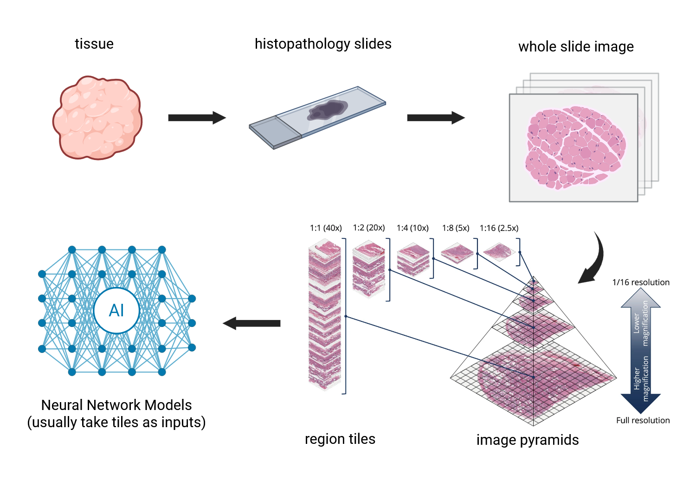

# Deep Learning Homework for Machine Learning 2025

In this homework, you will work on a small-scale deep learning project. It is structured to walk you through the major steps of all machine learning workflow:
- **Data preprocessing**
- **Model building and training**
- **Performance evaluation**

You will also learn how to run an experiment in a **high performance computing (HPC)** enviroment.
We will provide scaffolding code and instructions to help you with the task.

## Introduction


A very common application of machine learning model in digital pathology is to predict an outcome, 
such as a disease diagnosis, based on scanned whole slide images. The basic concept is no different than the 
general purpose computer vision models, which are classifiers that predict a probability for a given input 
belonging to a particular category (e.g., a cat vs. a dog). What makes things a little complicated in 
digital pathology is the data. Instead of having cropped images of defined objects, a digital pathology model 
have to consume an extremely large whole slide image (tens of thousands by tens of thousands pixels in dimension). 
A common practice is to **tile** the WSI into numerous regions over a grid, each of the region image is of 
much smaller size (the tile size). This tiling process can happen over different resolution levels.

## Data
In this homework, you are going to train a binary classifier to tell if a slide is from an endometrial tumor sample 
or from normal tissue control. All data are from the public CPTAC consortium, and we have already preprocessed 
the WSIs and extracted tiles at 3 different resolutions, The resulting tiles are all 299 by 299 pixels. 
You can find them at `/gpfs/data/courses/ml_2025/data/courses/ml2025/data`. The directories are orgianized as following:
```
data/
├── C3L-00006/
│   ├── 21/
│   │   ├── level1/
│   │   │   ├── region_x-10000-y-10500.png
│   │   │   ├── region_x-10000-y-11000.png
│   │   │   ├── ...
│   │   │   └── region_x-9500-y-27500.png
│   │   ├── level2/
│   │   └── level3/
│   └── 26/
├── C3L-00008/
├── ...
└── C3N-03044/
```
The first level is `Patient_ID` (values like `C3L-00006`, etc.). Under each `Patient_ID`, each subfolder contain data 
from the corresponding slide. One of them is tumor tissue, and the other is normal tissue. For each slide, 
there are data from three different levels (10X, 5X and 2.5X). In this project, we are going to use level 1, 
which is 10X resolution.

For your covenience, we provide a table with the `Patient_ID`, `Slide_ID`, path to the tile image on HPC, 
and the tumor/normal status. Note that the tumor/normal status is the same for all tiles belonging to the 
same **slide**. We have also created a sampled version of this table, in which we randomly sampled 10 tiles from each slide.
The first a few lines of the table look like this:

| Patient_ID   | Slide_ID     | Tumor   | L1path                                                                        | tumor_code   | Tumor_Normal   |
|:-------------|:-------------|:--------|:------------------------------------------------------------------------------|:-------------|:---------------|
| C3L-00006    | C3L-00006-21 | UCEC    | /gpfs/data/courses/ml2025/data/C3L-00006/21/level1/region_x-23500-y-10000.png | UCEC         | tumor          |
| C3L-00006    | C3L-00006-21 | UCEC    | /gpfs/data/courses/ml2025/data/C3L-00006/21/level1/region_x-8000-y-13000.png  | UCEC         | tumor          |
| C3L-00006    | C3L-00006-21 | UCEC    | /gpfs/data/courses/ml2025/data/C3L-00006/21/level1/region_x-15500-y-12000.png | UCEC         | tumor          |
| C3L-00006    | C3L-00006-21 | UCEC    | /gpfs/data/courses/ml2025/data/C3L-00006/21/level1/region_x-17500-y-18000.png | UCEC         | tumor          |
| C3L-00006    | C3L-00006-21 | UCEC    | /gpfs/data/courses/ml2025/data/C3L-00006/21/level1/region_x-13000-y-22500.png | UCEC         | tumor          |

## Model and Training Setup
We'd like you to train a **tile** level classifier that tell tumor tiles from normal tiles. You can use any architectures you like.
It can be a model that you build from scratch, or an implementation that you import directly from libraries such as `timm` and `torchvision`.
We will give an example using a `torchvision` model.
You want to follow a standard machine learning workflow: the entire dataset will be split into **train**, **validation**
and **test** sets with a **8:1:1** ratio. Since there are likely a lot of shared features among tiles belonging to the same patient, you want to 
split the data on `Patient_ID` level, such that all tiles with the same `Patient_ID` will appear all together in only one 
of the splits. 

## Performance Evaluation
We'd like you to evaluate the perforamnce of your model on **slide** level, meaning that you want to calculate 
performance metrics such as AUROC with slide-level probabilities and true labels. Recall that your model is trained 
with a tile-level setting, and it will make predictions for each tile in your test set. You will have to 
**aggregate** the tile-level predictions into a slide-level probability score. 

## Final Submissions
In your final submission, we'd like you to include the following items:
- A data table (`.csv` file) showing your train/validation/test split. It should contain a column `Patient_ID` 
and a column `split`, indicating which split each `Patient_ID` was assigned to.
- A data table (`.csv` file) with predicted probability values for each **slide**. It should contain a column `Slide_ID`
and a column `score`.
- A list of `average_training_loss` and `average_validation_loss` at the end of each epoch. You can also generate a plot for this.
- An ROC plot (a `.png` file), showing the final performance evaluation of your trained model on your test split. 
As specified above, this should be on **slide** level. One the graph you want to print the **AUROC** value of this plot.
- Your code. This can be a `.py` script or a `.ipynb` notebook. You can also integrate the tables and plots in the 
notebook if you want.


